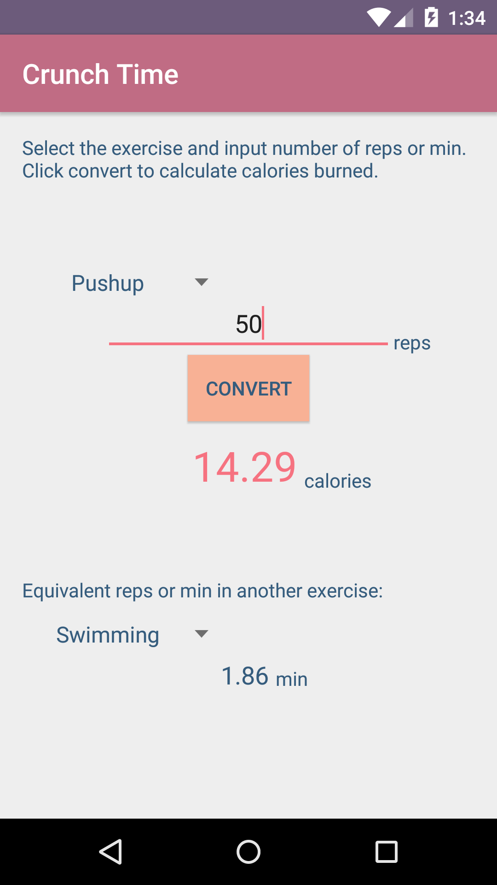

# PROG 01: Crunch Time

Functionality

∗	This Android application converts repetitions or minutes of an exercise to number of calories burned.
∗	It also automatically shows the number of repetitions or minutes required in another exercise to burn the same number of calories.
∗	The label changes automatically depending on the exercise.
∗	Twelve exercises are included in the list.

How to Use

∗	Select an exercise from the drop down list.
∗	Enter the number of repetitions or minutes completed.
∗	Press the convert button to calculate the number of calories burned as well as repetitions or minutes required in another exercise to burn the same number of calories.
∗	To see the calorie calculation for a different exercise and/or a different number of repetitions or minutes, input them and press the convert button again.
∗	Equivalent exercises are generated automatically based on the calories shown and do not need button presses.

## Authors

Kathy Liang ([kathyyliang@berkeley.edu](mailto:kathyyliang@berkeley.edu))

## Demo Video

See [prog1](https://youtu.be/7uJkJUpwdxc)

## Screenshots

## Acknowledgments

* [http://developer.android.com/develop/index.html](http://developer.android.com/develop/index.html)

